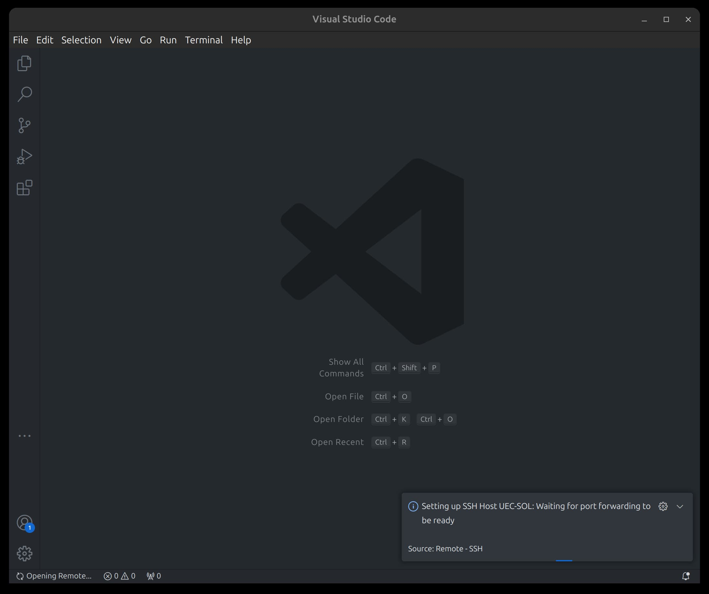
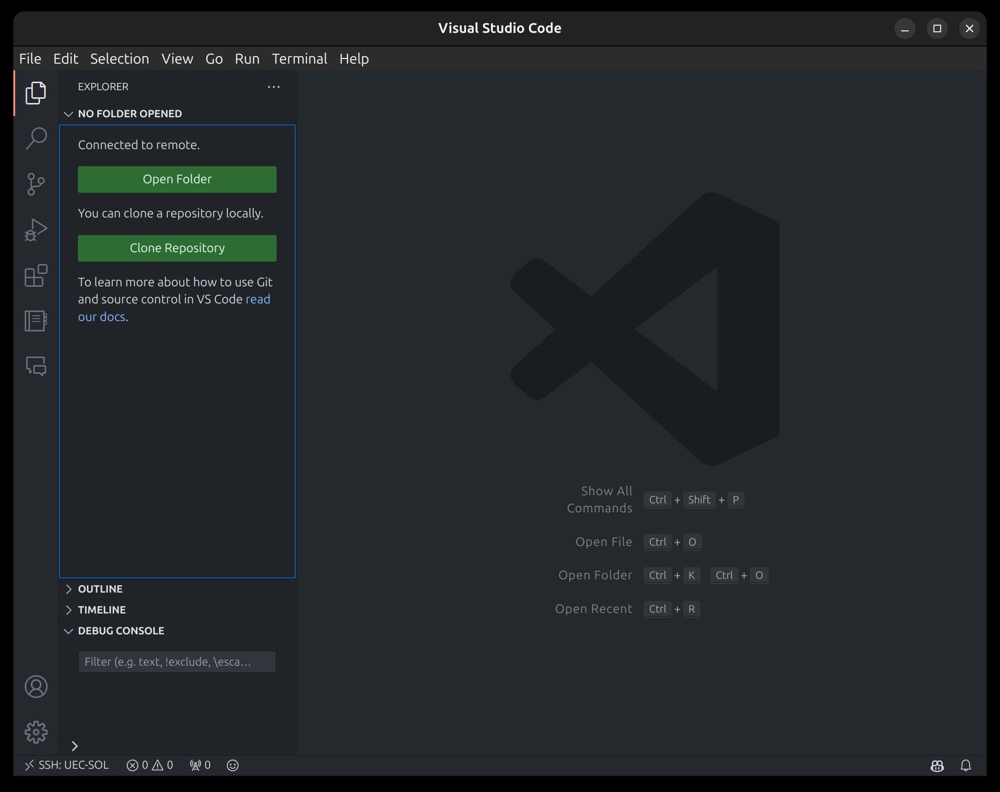
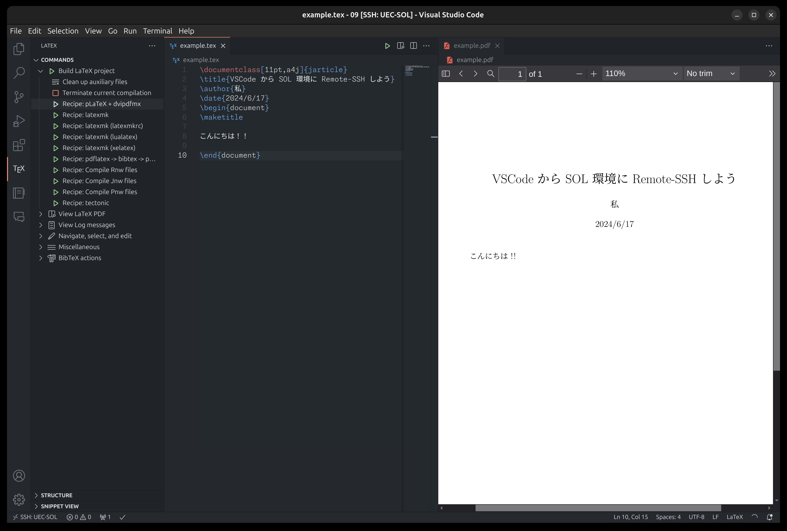

## 対象読者


- Emacs が嫌い
- コンピューターリテラシーの課題が大変だと思う
- SSH を聞いたことがある


## はじめに
コンピューターリテラシーの授業における課題で、何回かSOL環境にアクセスしてファイルを編集したり、PDFを書き出す作業を行ったと思います。

:::note
**SOL環境とは？**
一言で言えばコンリテの授業で使ってるあの Linux 環境のことです。家でもコンリテの課題等ができるように接続する方法が提供されています。
詳細: https://www.cc.uec.ac.jp/ug/ja/edu_srv/index.html
:::

その際にあなたがどんなテキストエディタを使ったかわかりませんが、9割くらいの人は授業で教わった Emacs を使ったかもしれません。

<div style="width: 500px;">

> 
> --<cite>なな転び八起のAWS開発日記 https://x.com/awscloud_jp/status/1042686051066814464</cite>

</div>

別に使いたいもの使えばいいとは思うんですけど、ファイルのアップロード/ダウンロードがしたかったり、いろんな操作がしたいとなると XQuartz 経由でいろいろやったいるするのは絶対に使いづらいはずです。

そこで、今回は VSCode という素晴らしきテキストエディタを使って、SOL環境への接続とファイル編集・アップロード・ダウンロードを楽にする方法を紹介します。

## 前提

### VSCode インストール

VSCode をお持ちで無い方は先にインストールしてからここに戻ってきてください。

VSCode 公式サイト: https://code.visualstudio.com/

わかりやすいインストール解説記事:
- Windows への Visual Studio Code のインストール方法 https://www602.math.ryukoku.ac.jp/Prog1/vscode-win.html
- macOS への Visual Studio Code のインストール方法 https://www602.math.ryukoku.ac.jp/Prog1/vscode-mac.html
- Linux はちょっと面倒ですが、Linux 使ってる人であれば既に自分でインストールしてると思います

### 公開鍵を登録しよう

SSH 機能を利用するため、[ITC ユーザーズガイド](https://www.cc.uec.ac.jp/ug/ja/remote/ssh/index.html#id7) に従って公開鍵を登録してからここに戻ってきてください。

SSH - 鍵ペア（公開鍵と秘密鍵）によるログイン: https://www.cc.uec.ac.jp/ug/ja/remote/ssh/index.html#id7

## `.ssh/config` をセットアップ

公開鍵を登録したついでに設定しちゃった人もいるかもしれませんが、後で使うので説明します。

通常、SSH 接続を行うには

```bash
ssh z2400123@ssh.cc.uec.ac.jp
```

のようにしますが、秘密鍵のファイルパスの指定をしたい場合やそもそもアドレスが長ったらしくて入力めんどいという場合に、プリセット的なのを登録して簡易化できます。

`~/.ssh/config` に以下のように記述します:

```
Host UEC-SOL
    HostName sol.cc.uec.ac.jp
    User z2400123
    IdentityFile ~/.ssh/id_ed25519
```

`UEC-SOL` という名前で、「ユーザー `z2400123` で `~/.ssh/id_ed25519` の秘密鍵を使って `sol.cc.uec.ac.jp` に接続」するという意味です。ここで指定する秘密鍵は、先程登録した公開鍵とペアになるものを指定します。

この設定を行うと、

```bash
ssh UEC-SOL
```

だけで接続することができるようになります。簡単になったね！

## VSCode 拡張機能を入れる

[Remote-SSH 拡張](https://marketplace.visualstudio.com/items?itemName=ms-vscode-remote.remote-ssh) を入れます。


## SOL に接続する

VSCode の左下にある「＞＜」みたいなボタンをクリックし、


「Connect to Host...」を選びます。


先程 `.ssh/config` で書いた `UEC-SOL` があると思うので、それを選択します。すると、新しいウィンドウが開きます。

もしかしたらこの後に Linux かどうかを聞かれるかもしれないですが、Linux 選んでほかはいい感じに選んでください。しばらくすると、



のように、右下にセットアップ中っぽいメッセージが出るので終わるまで少し待ちます。

エラーなく終われば、実質作業は終わりになります。



あとは「Open Folder」(日本語化してれば「フォルダを開く」かも)などから作業するフォルダを開くと、いい感じにファイル編集ができます。VSCode 自体の使い方はめんどいので説明しないのでググってください。



↑のスクリーンショットは、追加でTexLiveのセットアップしたので LaTeX Workshop 拡張機能が動いてますが、セットアップ直後は動かないと思います。気力があればここの解説記事も書くかもです。

## おわり

文明の利器を使って楽をしよう！！！！！


