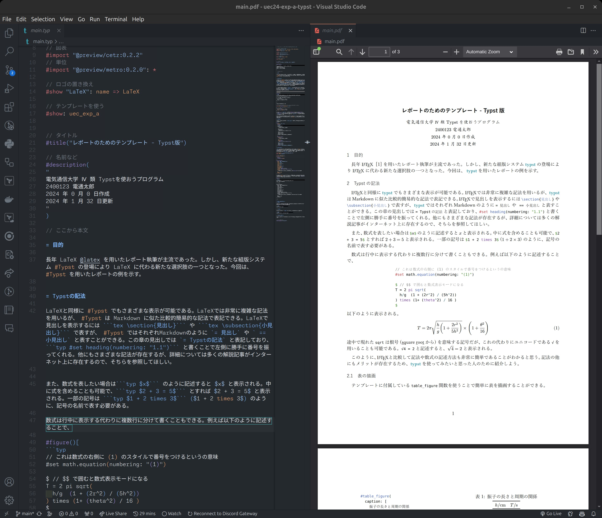
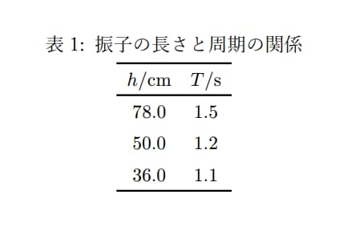

これを読んでいる人にとっておそらくいちばん重要なのは、「簡単にレポート課題をこなせるかどうか」かもしれませんが、「簡単に」できるかは保証できません。ただ、私は Typst を使って **レポートの書式については文句を言われなかった** ので、プログラミングに馴染みがある人にはぜひおすすめです。

### 対象読者

- LaTeX に不満を持っている
- 基礎科学実験A のレポートが面倒くさいと思っている
- Git と GitHub がわかる
- winget/brew/snap のどれかがわかる
- Google でわからないことを調べる方法がわかる
- 英語のサイトをGoogle翻訳使って自力で読める

## はじめに

**Word**、**Google ドキュメント** や **LaTeX**、それらが私達大学生にとってレポートを書くために欠かせないツールであることは、学部１年春タームを経て感じたことだと思います。特に、電気通信大学名物(?)である基礎科学実験A1のレポート課題では、「実験を行いレポートを書く」という作業自体慣れていないものであるため、非常に大変な思いをした、もしくはこれからするかもしれません。

その要因は学術的なスタイルでの長文の執筆だったり、初めて行う実験や煩雑なデータの整理があるかもしれませんが、最も大きな要素として **「慣れないツール」の使用** が求められることがあるかもしれません。Word を多少触ったことがある人は多いかもしれませんが、学術的な形態で文書を体験や LaTeX を用いた本格的な組版の体験をしたことがある人は少ないと思います。

レポートを書く際には、表やグラフ・引用中などを正しく表示する必要があります。Word では、スタイルを直感的に変更することは簡単かもしれませんが、**数式の扱いや引用番号の管理が煩雑** になってしまうかもしれません。多くの論文で使われている LaTeX は高機能ですが、**環境構築が大変** だったり、**エラーメッセージが不親切** で解決に苦労することが多いでしょう。そこで、今回紹介する Typst では、これらの **問題点を解決して、手軽にレポートを書く** ことができるようになります。

後述しますが Typst はツールとして新しいため、日本語のサポート情報や安定した動作に欠ける可能性があります。そのため、ある意味では上級者向けではありますが、チャレンジして損することはないくらい手軽なので、ぜひ試してみると今後の大学生活が快適になるかもしれません。

## Typst とは

Typst とは、一言で言えば「LaTeX を使いやすくしたもの」でしょう。[公式サイト](https://typst.app/) にはこのような表現があります:

> Typst was born out of our frustration with LaTeX. (Typst は LaTeX の不満から生まれました)
>
> -- <cite>Typst 公式サイト https://typst.app/</cite>


まさにその言葉の通り、LaTeX の使いにくさで挙げられる、

- 環境構築の難易度
- コンパイル速度
- エラーメッセージ
- 覚えづらい記法 (個人差あり)

を解決しています。見てもらったほうが速いですが、**Typst の記法は Markdown とよく似ています**。プログラミング経験者であれば簡単に理解できるでしょう:

```typst
// スラッシュを２つ使うことでコメントになります
#set text(lang: "ja") // 日本語に設定します

= 見出しです

こんにちは。吾輩は猫です。

文章中に数式を表示するには $y = f(x)$ と書きます。大きく表示したい場合は、改行して

#set math.equation(numbering: "(1)") // 数式に番号を表示する設定をします

$
S = 4/3　pi r^3 
$ <円の面積>

のようにします。@円の面積 は円の面積を求める公式です。
```

このように表示されます:


当然ですが、初期インストールされた状態のままで日本語を表示することが可能です。数式の書き方など、LaTeX と比べて非常に簡易になっていることがわかると思います。

このような形で Markdown に非常に近い形で記述することができます。

### デメリット

メリットは多いですが、デメリットも少しあります。

- **新しいツールのため、情報が少ない**
    - 日本語はおろか、英語でも情報が少ないことがあるため、英語の公式ドキュメントを自分で読み解く必要が出てくる場合があります
    - エラーメッセージは LaTeX よりも親切ですが、それでも情報が少ないことから解決に苦労する可能性があります
- **発展途上なことから、機能が不足している**
    - 情報が少ないのも相まって、主に表やグラフの表示で苦労するかもしれません。
- **パソコン初心者向けではない**
    - プログラミング経験があれば簡単ですが、そうでないと難易度が高いでしょう
- **学会では使えない可能性が高い**
    - LaTeX しか受け付けていない学会が多いと思うので、ここで Typst を覚えても役に立たない可能性もあります


## 導入

さて、この Typst を導入する方法について説明します。Typst は Windows、macOS、Linux でもれなく動作します。[公式レポジトリ](https://github.com/typst/typst?tab=readme-ov-file#installation)を参考にインストールします。

::github{repo="typst/typst"}

Windows の場合 (`winget`):

```bash
winget install --id Typst.Typst
```

macOS の場合 (`brew`):

```bash
brew install typst
```

Ubuntu の場合 (`snap`):

```bash
snap install typst
```

UEC の SOL 環境に入れたい場合は Rust の `cargo` 経由でインストールすることができます:

```bash
cargo install --locked typst-cli
```

これだけでインストール完了です！

次のステップでは、他の Typst 紹介記事を読んで雰囲気を使うむのがよいでしょう。これらの記事を読むと Typst が使いたくなってくるはずです:

- 話題の組版エンジン Typst を触ってみた https://zenn.dev/monaqa/articles/2023-04-19-typst-introduction
- Typst： いい感じのLaTeXの代替 http://www-het.phys.sci.osaka-u.ac.jp/~yamaguch/j/typst.html
- Typstのここがすごい！！ https://qiita.com/hikoharu14142/items/aa8cfb70d079b0324fba

### VSCode 拡張機能

VSCode 拡張機能も用意されていて、インストールすることでホットリロードのような感じで執筆ができます。体験が非常に向上します。

VS Marketplace リンク: https://marketplace.visualstudio.com/items?itemName=nvarner.typst-lsp


## 使用例

ここに、私が使った基礎科学実験 A1 用のテンプレートを上げてありますので、自由に使ってください。

::github{repo="teshu0/uec24-exp-a-typst"}

`git clone` したりテンプレートとして新しくレポを作成してください。ローカルに `git clone` した前提で進めます。基本的に `main.typ` を編集して進めます。Typst のファイル拡張子は `.typ` です。`main.typ` を読むと基本的な使用方法がわかるようになっています。



同じディレクトリにある `uec_exp_a.typ` がテンプレートのファイルになっているので、それを読み込んで使う形になっています。テンプレートは、基礎科学実験A1 で配布されていた LaTeX テンプレートの設定をなるべく再現するようになっています。

表を表示するには、テンプレートで定義されている `table_figure()` 関数を使うと綺麗に表示できます。

```typst
#table_figure(
    caption: [
        振子の長さと周期の関係
    ],
    columns: 2,
    table.header(
        $h#unit("/cm")$, $T#unit("/s")$,
    ),
    $78.0$, $1.5$,
    $50.0$, $1.2$,
    $36.0$, $1.1$,
) #label("振子の長さと周期の関係の表")
```

このようになります:



表の数値は CSV ファイルから読み込んで表示することもできたり、様々な機能がついています。

CSV Function - Typst https://typst.app/docs/reference/data-loading/csv/

困ったら公式ドキュメントを読むと解決します。

## おわりに

基礎科学実験A レポートを執筆する学生のため、LaTeX の代わりとなる Typst を紹介しました。引用の管理や配置の設定について書く気力がなかったのでかけませんでしたが、公式ドキュメントを参照してもらうことでどうにかなると思います。また、テンプレートではいくつかの便利なライブラリを使用していますが、その紹介もできていません。Typst では CeTZ というライブラリを用いると、Typst 単体で図やグラフを描画することができるようになるのですが、CeTZ だけでいくつかの記事がかけてしまうので、またの機会にします。

## 資料

- Typst 公式サイト https://typst.app/

